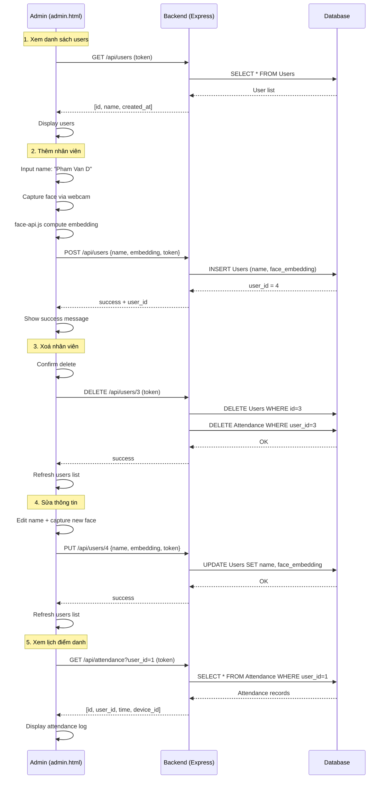
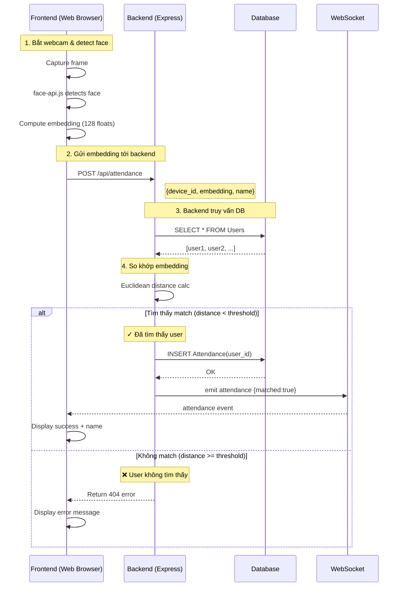

# Luồng Dữ Liệu (Data Flow)

Tài liệu này mô tả chi tiết luồng dữ liệu giữa các thành phần khi thực hiện quét khuôn mặt và ghi nhận điểm danh.

---

## 📊 Sơ Đồ Tổng Quan

```
┌─────────────────────┐
│   Frontend (Web)    │
│  - Bắt webcam       │
│  - face-api.js      │
│  - Tính embedding   │
└──────────┬──────────┘
           │ HTTP POST
           │ /api/attendance
           ▼
┌─────────────────────┐
│   Backend (Node.js) │
│  - Express Server   │
│  - So khớp distance │
│  - WebSocket emit   │
└──────────┬──────────┘
           │ Query/Insert
           ▼
┌─────────────────────┐
│   Database (DB)     │
│  - SQLite/SQL Srv   │
│  - Users Table      │
│  - Attendance Log   │
└─────────────────────┘
```

---

## 1️⃣ Frontend → Backend: Gửi Face Embedding

### 📤 Request: `POST /api/attendance`

**Nơi gửi:** JavaScript trong `frontend_client/index.html` (face-api.js)

**Template dữ liệu gửi:**

```json
{
  "device_id": "laptop-1",
  "embedding": [
    0.0123, 0.2345, 0.5432, -0.1234, 0.0987,
    -0.4567, 0.2341, 0.1111, -0.9999, 0.5555,
    "..."  // tổng ~128 số thực
  ],
  "name": "Unknown",
  "image": null
}
```

**Chi tiết các field:**

| Field | Kiểu | Mô tả |
|-------|------|-------|
| `device_id` | string | ID thiết bị (laptop-1, py-cam-01, ...) |
| `embedding` | array[float] | Mảng 128 số thực đại diện khuôn mặt (tính bởi face-api.js) |
| `name` | string | Tên người (hoặc "Unknown" nếu mới) |
| `image` | string/null | Base64 của ảnh (tùy chọn, nếu SAVE_IMAGES=true) |

**Ví dụ thực tế (rút gọn):**

```json
{
  "device_id": "webcam-001",
  "embedding": [0.12, -0.34, 0.56, 0.78, -0.90, 0.11, ...],
  "name": "Nguyen Van A",
  "image": null
}
```

---

## 2️⃣ Backend: Xử Lý & So Khớp

### 🔄 Quy Trình Backend

1. **Nhận request từ Frontend**
   - Parse JSON payload
   - Lấy `embedding` (128 số)

2. **Truy vấn Database**
   - SELECT tất cả users từ bảng `Users`
   - Lấy `face_embedding` của mỗi user

3. **So khớp (Matching)**
   - Tính Euclidean distance giữa embedding client vs mỗi user trong DB
   - So sánh với `EMBEDDING_THRESHOLD` (mặc định: 0.6)
   - Nếu distance < threshold → Match!

4. **Lưu Attendance & Phát Signal**
   - INSERT record vào `Attendance` table
   - Emit WebSocket event tới frontend

### 📋 Database Queries

**Query: Lấy tất cả users**
```sql
SELECT id, name, face_embedding FROM Users;
```

**Response từ DB:**
```json
[
  {
    "id": 1,
    "name": "Nguyen Van A",
    "face_embedding": "[0.12, -0.34, 0.56, ...]"
  },
  {
    "id": 2,
    "name": "Tran Thi B",
    "face_embedding": "[0.19, -0.41, 0.63, ...]"
  }
]
```

---

## 3️⃣ Backend → Database: Lưu Dữ Liệu

### 📝 Trường Hợp 1: Match Thành Công

**Khi:** Khoảng cách < EMBEDDING_THRESHOLD

**INSERT vào `Attendance`:**
```sql
INSERT INTO Attendance (user_id, time, device_id, image_path)
VALUES (1, '2024-01-15 09:30:45', 'laptop-1', NULL);
```

**Dữ liệu lưu:**
```json
{
  "id": 101,
  "user_id": 1,
  "time": "2024-01-15T09:30:45Z",
  "device_id": "laptop-1",
  "image_path": null,
  "created_at": "2024-01-15T09:30:45Z"
}
```

### 🆕 Trường Hợp 2: Không Match (User Chưa Được Đăng Ký)

**Khi:** Không tìm thấy user nào có distance < EMBEDDING_THRESHOLD

**Tuỳ chọn xử lý:**

#### **Tuỳ Chọn A: Từ Chối & Trả Về Lỗi (Được Khuyến Nghị)**

Backend trả về 404 Not Found - yêu cầu admin đăng ký trước:

```json
{
  "success": false,
  "error": "User not found",
  "message": "Khuôn mặt không được nhận dạng. Vui lòng liên hệ admin để đăng ký.",
  "matched": false
}
```

**Frontend hiển thị:**
```
❌ KHÔNG NHẬN DẠNG
"Khuôn mặt không được nhận dạng. Vui lòng liên hệ admin để đăng ký."
```

**Admin xử lý:**
- Người dùng liên hệ admin
- Admin mở `admin.html` → Nhấn "Thêm nhân viên"
- Admin capture khuôn mặt + input tên → tạo user mới

---

#### **Tuỳ Chọn B: Lưu Vào Bảng "PendingUsers" (Tạm Thời)**

Backend lưu vào bảng tạm để admin review:

**Tạo bảng `PendingUsers`:**
```sql
CREATE TABLE PendingUsers (
  id INTEGER PRIMARY KEY AUTOINCREMENT,
  name VARCHAR(100) DEFAULT 'Unknown',
  face_embedding TEXT NOT NULL,
  device_id VARCHAR(50),
  image_path VARCHAR(255),
  status VARCHAR(20) DEFAULT 'pending',  -- pending, approved, rejected
  created_at TIMESTAMP DEFAULT CURRENT_TIMESTAMP
);
```

**Backend INSERT vào `PendingUsers`:**
```sql
INSERT INTO PendingUsers (name, face_embedding, device_id, status, created_at)
VALUES ('Unknown', '[0.21, 0.33, 0.45, ...]', 'laptop-1', 'pending', NOW());
```

**Response:**
```json
{
  "success": true,
  "status": "pending",
  "message": "Khuôn mặt mới chưa được đăng ký. Đang chờ admin phê duyệt.",
  "matched": false
}
```

**Admin xử lý:**
- Mở `admin.html` → Xem danh sách "Pending Users"
- Review embedding & hình ảnh
- Nếu hợp lệ → Nhấn "Phê duyệt" → Tạo user chính thức
- Nếu không hợp lệ → Nhấn "Từ chối" → Xoá khỏi pending

---

#### **Tuỳ Chọn C: Lưu Vào Attendance Với user_id = NULL (Log Tạm)**

Backend lưu record attendance nhưng với `user_id = NULL`:

```sql
INSERT INTO Attendance (user_id, time, device_id, image_path, face_embedding)
VALUES (NULL, '2024-01-15 09:35:12', 'laptop-1', NULL, '[0.21, 0.33, ...]');
```

**Response:**
```json
{
  "success": false,
  "error": "Unknown face",
  "message": "Khuôn mặt không được nhận dạng",
  "matched": false,
  "attendance_id": 999
}
```

**Ưu điểm:** Admin có thể xem lịch "những ai cố gắng điểm danh nhưng không được nhận dạng"
**Nhược điểm:** Attendance table bị lộn xộn (có user_id = NULL)

---

### **🎯 Khuyến Nghị: Dùng Tuỳ Chọn A hoặc B**

- **Tuỳ Chọn A (đơn giản):** Từ chối & yêu cầu admin đăng ký thủ công
  - Phù hợp: Công ty nhỏ, số nhân viên ít
  - Điểm yếu: Kém tự động

- **Tuỳ Chọn B (chuyên nghiệp):** Lưu pending, admin review
  - Phù hợp: Công ty lớn, có IT admin
  - Điểm mạnh: Bán tự động, admin kiểm soát

---

## 4️⃣ Backend → Frontend: Phát Sự Kiện (WebSocket)

### 📡 Event: `attendance`

**Chỉ phát sự kiện khi tìm thấy match!** (Không phát khi không match)

**Socket.io event name:** `attendance`

**Template dữ liệu phát (Chỉ Match Case):**

```json
{
  "user_id": 1,
  "name": "Nguyen Van A",
  "time": "2024-01-15T09:30:45Z",
  "device_id": "laptop-1",
  "matched": true,
  "distance": 0.45
}
```

**Chi tiết:**

| Field | Kiểu | Mô Tả |
|-------|------|-------|
| `user_id` | number | ID của user trong database |
| `name` | string | Tên người (đã được đăng ký) |
| `time` | string | Thời gian điểm danh (ISO 8601) |
| `device_id` | string | ID thiết bị quét |
| `matched` | boolean | luôn = true (chỉ phát khi match) |
| `distance` | float | Khoảng cách Euclidean (0-1) |

### 📤 Khi Có Match:

```json
{
  "user_id": 1,
  "name": "Nguyen Van A",
  "time": "2024-01-15T09:30:45Z",
  "device_id": "laptop-1",
  "matched": true,
  "distance": 0.45
}
```

**Frontend hiển thị:**
```
✓ ĐIỂM DANH THÀNH CÔNG
👤 Nguyen Van A
⏰ 09:30:45
📍 laptop-1
```

### ❌ Khi Không Match:

**Backend KHÔNG phát event qua WebSocket**

**Frontend hiển thị lỗi local:**
```
❌ KHÔNG NHẬN DẠNG
"Khuôn mặt không được nhận dạng. Vui lòng liên hệ admin để đăng ký."
```

---

## 5️⃣ Database Schema

### 📊 Bảng `Users`

```sql
CREATE TABLE Users (
  id                  INTEGER PRIMARY KEY AUTOINCREMENT,
  name                VARCHAR(100) NOT NULL,
  face_embedding      TEXT NOT NULL,    -- JSON array của 128 số thực
  face_hash           VARCHAR(64),      -- MD5 hash (tùy chọn, tìm kiếm nhanh)
  created_at          TIMESTAMP DEFAULT CURRENT_TIMESTAMP
);
```

**Ví dụ dữ liệu:**
```json
{
  "id": 1,
  "name": "Nguyen Van A",
  "face_embedding": "[0.12, -0.34, 0.56, 0.78, -0.90, ...]",
  "face_hash": "a1b2c3d4e5f6...",
  "created_at": "2024-01-10T14:30:00Z"
}
```

### 📋 Bảng `Attendance`

```sql
CREATE TABLE Attendance (
  id                  INTEGER PRIMARY KEY AUTOINCREMENT,
  user_id             INTEGER NOT NULL,
  time                TIMESTAMP NOT NULL,
  device_id           VARCHAR(50),
  image_path          VARCHAR(255),     -- Path nếu lưu ảnh
  created_at          TIMESTAMP DEFAULT CURRENT_TIMESTAMP,
  FOREIGN KEY(user_id) REFERENCES Users(id)
);
```

**Ví dụ dữ liệu:**
```json
{
  "id": 101,
  "user_id": 1,
  "time": "2024-01-15T09:30:45Z",
  "device_id": "laptop-1",
  "image_path": null,
  "created_at": "2024-01-15T09:30:45Z"
}
```

---

## 🔌 API Endpoints

### 1. Điểm Danh (Gửi Embedding)

**POST** `/api/attendance`

**Request:**
```json
{
  "device_id": "laptop-1",
  "embedding": [0.12, -0.34, 0.56, ...],
  "name": "Unknown",
  "image": null
}
```

**Response (200 OK - Match):**
```json
{
  "success": true,
  "user_id": 1,
  "name": "Nguyen Van A",
  "matched": true,
  "distance": 0.45,
  "message": "Attendance recorded"
}
```

**Response (404 Not Found - No Match):**
```json
{
  "success": false,
  "error": "User not found",
  "message": "Khuôn mặt không được nhận dạng. Vui lòng liên hệ admin để đăng ký.",
  "matched": false
}
```

---

### 2. Lấy Danh Sách Users

**GET** `/api/users`

**Header:**
```
x-admin-token: your-admin-token
```

**Response:**
```json
{
  "success": true,
  "data": [
    {
      "id": 1,
      "name": "Nguyen Van A",
      "created_at": "2024-01-10T14:30:00Z"
    },
    {
      "id": 2,
      "name": "Tran Thi B",
      "created_at": "2024-01-12T10:15:30Z"
    }
  ]
}
```

---

### 3. Lấy Lịch Điểm Danh

**GET** `/api/attendance?user_id=1&date=2024-01-15`

**Header:**
```
x-admin-token: your-admin-token
```

**Response:**
```json
{
  "success": true,
  "data": [
    {
      "id": 101,
      "user_id": 1,
      "name": "Nguyen Van A",
      "time": "2024-01-15T09:30:45Z",
      "device_id": "laptop-1"
    },
    {
      "id": 102,
      "user_id": 1,
      "name": "Nguyen Van A",
      "time": "2024-01-15T17:30:15Z",
      "device_id": "laptop-1"
    }
  ]
}
```

---

### 4. Thêm User (Admin)

**POST** `/api/users`

**Header:**
```
x-admin-token: your-admin-token
Content-Type: application/json
```

**Request:**
```json
{
  "name": "Nguyen Van C",
  "embedding": [0.25, -0.40, 0.62, ...]
}
```

**Response:**
```json
{
  "success": true,
  "user_id": 4,
  "name": "Nguyen Van C",
  "message": "User created successfully"
}
```

---

### 5. Xoá User (Admin)

**DELETE** `/api/users/:id`

**Header:**
```
x-admin-token: your-admin-token
```

**Response:**
```json
{
  "success": true,
  "message": "User deleted successfully"
}
```

---

### 6. Cập Nhật Thông Tin User (Admin)

**PUT** `/api/users/:id`

**Header:**
```
x-admin-token: your-admin-token
Content-Type: application/json
```

**Request:**
```json
{
  "name": "Nguyen Van C Updated",
  "embedding": [0.25, -0.40, 0.62, ...]
}
```

**Response:**
```json
{
  "success": true,
  "user_id": 4,
  "name": "Nguyen Van C Updated",
  "message": "User updated successfully"
}
```

---

## 👨‍💼 Admin Frontend Flow (`admin.html`)

Admin Panel cung cấp giao diện quản lý nhân viên. Các chức năng chính:

### **Chức Năng 1: Xem Danh Sách Nhân Viên**

**Action:** Nhấn "Lấy danh sách users"

**Frontend gửi:**
```
GET /api/users
Header: x-admin-token=your-token
```

**Backend response:**
```json
{
  "success": true,
  "data": [
    {"id": 1, "name": "Nguyen Van A", "created_at": "2024-01-10T14:30:00Z"},
    {"id": 2, "name": "Tran Thi B", "created_at": "2024-01-12T10:15:30Z"},
    {"id": 3, "name": "Unknown", "created_at": "2024-01-15T09:35:12Z"}
  ]
}
```

**Frontend hiển thị:**
```
Users
├─ 1 — Nguyen Van A [Xoá] [Sửa]
├─ 2 — Tran Thi B [Xoá] [Sửa]
└─ 3 — Unknown [Xoá] [Sửa]
```

---

### **Chức Năng 2: Thêm Nhân Viên Mới**

**Action:** Nhấn "Thêm nhân viên"

**Bước 1:** Admin nhập tên nhân viên
```
Tên: Pham Van D
```

**Bước 2:** Nhấn "Bắt đầu capture" → Webcam bắt đầu
```
[Webcam chạy]
```

**Bước 3:** Admin đặt mặt vào camera, frontend tự động capture khuôn mặt
```javascript
// face-api.js detect face
detections = await faceApi.detectSingleFace(video).withFaceLandmarks().withFaceDescriptors();
embedding = detections.descriptor;  // 128 floats
```

**Bước 4:** Frontend gửi data tới backend
```
POST /api/users
Header: x-admin-token=your-token
Content-Type: application/json

{
  "name": "Pham Van D",
  "embedding": [0.15, -0.28, 0.61, 0.85, -0.92, ...]
}
```

**Backend xử lý:**
```sql
INSERT INTO Users (name, face_embedding, created_at)
VALUES ('Pham Van D', '[0.15, -0.28, 0.61, ...]', NOW());
```

**Backend response:**
```json
{
  "success": true,
  "user_id": 4,
  "name": "Pham Van D",
  "message": "User created successfully"
}
```

**Frontend hiển thị:**
```
✓ Thêm nhân viên thành công
ID: 4, Tên: Pham Van D
```

---

### **Chức Năng 3: Xoá Nhân Viên**

**Action:** Nhấn nút "Xoá" cạnh một nhân viên

**Frontend gửi:**
```
DELETE /api/users/3
Header: x-admin-token=your-token
```

**Backend xử lý:**
```sql
-- Xoá từ Attendance table trước (Foreign Key)
DELETE FROM Attendance WHERE user_id = 3;
-- Xoá từ Users table
DELETE FROM Users WHERE id = 3;
```

**Backend response:**
```json
{
  "success": true,
  "message": "User deleted successfully"
}
```

**Frontend hiển thị:**
```
✓ Xoá nhân viên ID 3 thành công
```

---

### **Chức Năng 4: Sửa Thông Tin Nhân Viên**

**Action:** Nhấn nút "Sửa" cạnh một nhân viên

**Bước 1:** Admin chỉnh sửa tên
```
Tên cũ: Pham Van D
Tên mới: Pham Van D - IT Team
```

**Bước 2:** (Tùy chọn) Nhấn "Capture lại khuôn mặt" → Webcam bắt đầu capture embedding mới

**Bước 3:** Frontend gửi data cập nhật tới backend
```
PUT /api/users/4
Header: x-admin-token=your-token
Content-Type: application/json

{
  "name": "Pham Van D - IT Team",
  "embedding": [0.15, -0.28, 0.61, 0.85, -0.92, ...]  // mới hoặc cũ
}
```

**Backend xử lý:**
```sql
UPDATE Users 
SET name = 'Pham Van D - IT Team', 
    face_embedding = '[0.15, -0.28, 0.61, ...]'
WHERE id = 4;
```

**Backend response:**
```json
{
  "success": true,
  "user_id": 4,
  "name": "Pham Van D - IT Team",
  "message": "User updated successfully"
}
```

---

### **Chức Năng 5: Xem Lịch Điểm Danh**

**Action:** Nhấn "Tải lịch sử điểm danh"

**Frontend gửi:**
```
GET /api/attendance?user_id=1&date=2024-01-15
Header: x-admin-token=your-token
```

**Backend response:**
```json
{
  "success": true,
  "data": [
    {
      "id": 101,
      "user_id": 1,
      "name": "Nguyen Van A",
      "time": "2024-01-15T09:30:45Z",
      "device_id": "laptop-1"
    },
    {
      "id": 102,
      "user_id": 1,
      "name": "Nguyen Van A",
      "time": "2024-01-15T17:30:15Z",
      "device_id": "laptop-1"
    }
  ]
}
```

**Frontend hiển thị:**
```
Lịch sử điểm danh - Nguyen Van A
├─ 09:30:45 - laptop-1 [✓ Đã điểm danh]
└─ 17:30:15 - laptop-1 [✓ Đã điểm danh]
```

---

## 🔄 Admin Mermaid Sequence Diagram



---

## 📊 So Sánh 2 Frontend

| Feature | Camera Frontend (index.html) | Admin Frontend (admin.html) |
|---------|-----|-----|
| **Mục đích** | Quét khuôn mặt điểm danh | Quản lý nhân viên |
| **Main API** | POST /api/attendance | GET/POST/PUT/DELETE /api/users |
| **Data gửi** | embedding, device_id | name, embedding |
| **Thao tác** | Tự động capture & gửi | Thủ công (create/edit/delete) |
| **WebSocket** | Lắng nghe attendance events | Không dùng (admin chủ động load) |
| **Yêu cầu** | Webcam (camera) | Webcam (khi thêm/sửa nhân viên) |
| **Xác thực** | Không cần token | Cần x-admin-token |

---

## 🔐 Admin Token

- Token dùng để bảo vệ API admin (không cho ai cũng thêm/xoá user)
- Lưu trong `.env`: `ADMIN_TOKEN=your-secret-token`
- Mỗi request admin phải kèm: `x-admin-token: your-secret-token`
- Nếu token sai → Backend trả về 401 Unauthorized

**Ví dụ:**
```javascript
// Frontend
fetch('/api/users', {
  headers: { 'x-admin-token': 'your-secret-token' }
})
```

```javascript
// Backend
app.get('/api/users', (req, res) => {
  const token = req.headers['x-admin-token'];
  if (token !== process.env.ADMIN_TOKEN) {
    return res.status(401).json({ error: 'Invalid token' });
  }
  // Process request...
});
```

---

## 🔄 Mermaid Sequence Diagram (Camera Client - index.html)



---

## 📊 Ví Dụ Luồng Đầy Đủ

### Scenario 1: Người A Điểm Danh Lần Đầu (Chưa Được Đăng Ký)

**Bước 1:** Frontend capture → compute embedding
```json
embedding = [0.12, -0.34, 0.56, 0.78, -0.90, ...]  // 128 floats
```

**Bước 2:** Frontend POST tới backend
```json
{
  "device_id": "laptop-1",
  "embedding": [0.12, -0.34, 0.56, ...],
  "name": "Unknown"
}
```

**Bước 3:** Backend query DB
```sql
SELECT id, name, face_embedding FROM Users;  -- (trống hoặc không có A)
```

**Bước 4:** Backend so khớp
```
Tính Euclidean distance với mỗi user
Kết quả: Không có ai match (distance >= 0.6)
→ User not found!
```

**Bước 5:** Backend trả về lỗi (KHÔNG phát WebSocket event)
```json
{
  "success": false,
  "error": "User not found",
  "message": "Khuôn mặt không được nhận dạng. Vui lòng liên hệ admin để đăng ký."
}
```

**Bước 6:** Frontend hiển thị lỗi
```
❌ KHÔNG NHẬN DẠNG
"Khuôn mặt không được nhận dạng. Vui lòng liên hệ admin để đăng ký."
```

---

### Scenario 2: Admin Đăng Ký Người A

**Bước 1:** Admin mở `admin.html` → Nhấn "Thêm nhân viên"
```
Tên: Nguyen Van A
```

**Bước 2:** Admin bấm "Bắt đầu capture" → webcam chạy → face-api.js tính embedding
```javascript
detections = await faceApi.detectSingleFace(video)
  .withFaceLandmarks()
  .withFaceDescriptors();
embedding = detections.descriptor;  // [0.12, -0.34, 0.56, ...]
```

**Bước 3:** Admin gửi data tới backend
```
POST /api/users
Header: x-admin-token=your-token

{
  "name": "Nguyen Van A",
  "embedding": [0.12, -0.34, 0.56, ...]
}
```

**Bước 4:** Backend INSERT vào Users
```sql
INSERT INTO Users (name, face_embedding, created_at)
VALUES ('Nguyen Van A', '[0.12, -0.34, 0.56, ...]', NOW());
```

**Bước 5:** Backend response
```json
{
  "success": true,
  "user_id": 1,
  "name": "Nguyen Van A",
  "message": "User created successfully"
}
```

**Bước 6:** Admin thấy thông báo thành công
```
✓ Thêm nhân viên thành công
ID: 1, Tên: Nguyen Van A
```

---

### Scenario 3: Người A Điểm Danh Lần Thứ 2 (Đã Được Đăng Ký)

**Bước 1:** Frontend capture → compute embedding (giống A)
```json
embedding = [0.12, -0.34, 0.56, 0.78, -0.90, ...]
```

**Bước 2:** Frontend POST tới backend
```json
{
  "device_id": "laptop-1",
  "embedding": [0.12, -0.34, 0.56, ...],
  "name": "Unknown"
}
```

**Bước 3:** Backend query DB
```sql
SELECT id, name, face_embedding FROM Users;
-- Kết quả: (1, 'Nguyen Van A', '[0.12, -0.34, 0.56, ...]')
```

**Bước 4:** Backend so khớp
```
Tính Euclidean distance:
  distance(new_embedding, user1_embedding) = 0.05
Kết quả: MATCH! (0.05 < 0.6)
→ Tìm thấy user_id = 1
```

**Bước 5:** Backend INSERT vào Attendance
```sql
INSERT INTO Attendance (user_id, time, device_id)
VALUES (1, '2024-01-15 09:30:45', 'laptop-1');
```

**Bước 6:** Backend phát WebSocket event
```json
{
  "user_id": 1,
  "name": "Nguyen Van A",
  "time": "2024-01-15T09:30:45Z",
  "device_id": "laptop-1",
  "matched": true,
  "distance": 0.05
}
```

**Bước 7:** Frontend nhận event & hiển thị
```
✓ ĐIỂM DANH THÀNH CÔNG
👤 Nguyen Van A
⏰ 09:30:45
📍 laptop-1
🔊 (phát âm thanh "ding")
```

---

## ⚙️ Cấu Hình Quan Trọng

| Parameter | Mô Tả | Giá Trị Mặc Định |
|-----------|-------|-----------------|
| `EMBEDDING_THRESHOLD` | Ngưỡng so khớp embedding | 0.6 |
| `SAVE_IMAGES` | Có lưu ảnh không | false |
| `DEVICE_ID` | ID thiết bị quét | laptop-1 |
| `COOLDOWN` | Thời gian chờ giữa các lần gửi | 2-5s |
| `ADMIN_TOKEN` | Token bảo vệ API admin | (cấu hình trong .env) |

---

## 📝 Ghi Chú

- **Embedding:** Là mảng 128 số thực đại diện khuôn mặt (deep learning model output)
- **Distance:** Khoảng cách Euclidean (0 = giống hệt, 1+ = khác hoàn toàn)
- **Threshold:** Nếu distance < 0.6 → match, >= 0.6 → không match
- **User Mới:** Chỉ được tạo qua **Admin Panel** (`admin.html`), KHÔNG tự động tạo khi điểm danh
- **Realtime:** Frontend lắng nghe WebSocket event từ backend để cập nhật UI ngay lập tức

---
