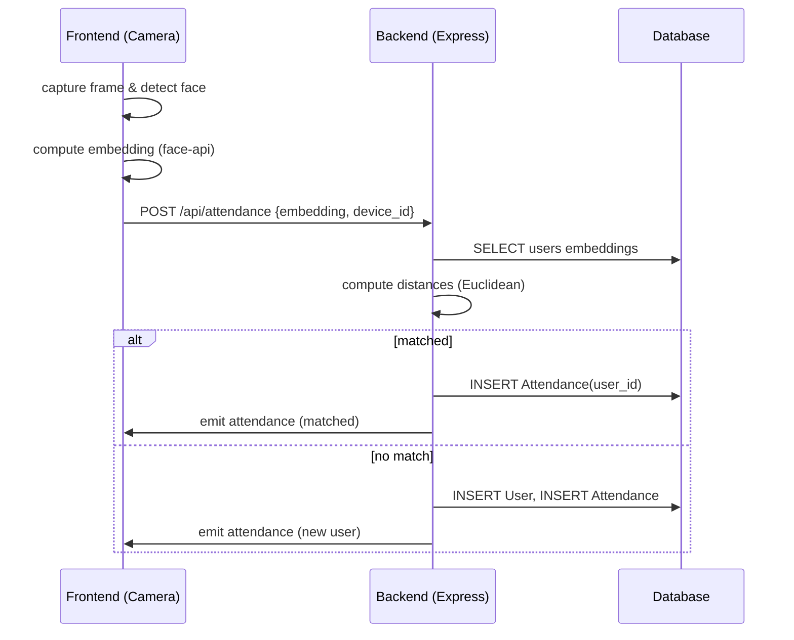

# Luồng dữ liệu (Data Flow)

Tài liệu này mô tả luồng dữ liệu chính khi một máy (laptop) thực hiện quét khuôn mặt và ghi nhận điểm danh.

1) Frontend (trình duyệt, `frontend_client/index.html`)
   - Bắt khung hình từ webcam.
   - Sử dụng face-api.js để phát hiện khuôn mặt, vẽ bounding box trên overlay canvas và tính embedding (descriptor).
   - Gửi embedding (mảng số), cùng `device_id` và tuỳ chọn ảnh (base64) tới backend qua `POST /api/attendance`.

2) Backend (server Express, `backend/index.js`)
   - Nhận payload từ client.
   - Nếu kèm ảnh và `SAVE_IMAGES=true`, lưu ảnh vào disk.
   - Lấy danh sách embeddings từ `Users` (qua `backend/db.js`) và so khớp bằng khoảng cách Euclidean.
   - Nếu có match trong `EMBEDDING_THRESHOLD`:
     - Ghi `Attendance` cho `user_id` tương ứng.
     - Phát sự kiện realtime `attendance` (socket) gửi `user`, `time`, `matched: true`.
   - Nếu không có match:
     - Tạo user mới (tạm tên `Unknown` hoặc do UI cung cấp), lưu embedding vào `Users`.
     - Ghi `Attendance` cho user mới, phát sự kiện `attendance` (new user).

3) Database (`backend/db.js` — SQLite mặc định / optional SQL Server)
   - Bảng `Users`: `id`, `name`, `face_hash` (tuỳ), `face_embedding` (JSON/BLOB), `created_at`.
   - Bảng `Attendance`: `id`, `user_id`, `time` (timestamp), `device_id`, `image_path`.

4) Frontend hiển thị
   - Frontend nhận sự kiện socket `attendance` và hiển thị badge/âm thanh.
   - Admin (`frontend_client/admin.html`) có thể truy vấn `GET /api/attendance` và quản lý `Users`.

Ví dụ payload JSON gửi tới `POST /api/attendance`:

```json
{
  "device_id": "laptop-1",
  "embedding": [0.0123, 0.2345, 0.5432, ...],
  "image": null
}
```

Mermaid sequence (mô tả ngắn):



Ghi chú vận hành:
- `EMBEDDING_THRESHOLD` (backend) quyết định ngưỡng nhận diện; điều chỉnh theo thực tế.
- Client nên có cooldown (ví dụ 2–5s) sau khi gửi embedding để tránh spam requests.
- Cân nhắc lưu thêm checksum/face_hash để hỗ trợ tìm kiếm nhanh.
